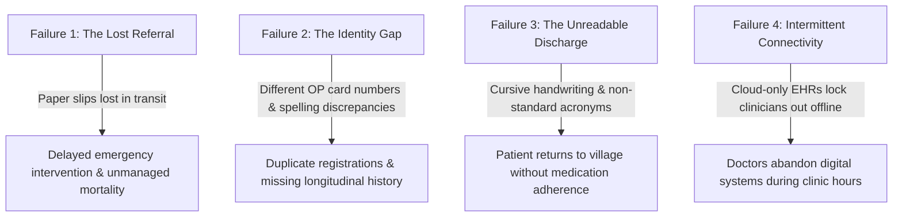

# SwasthyaSetu — AI Agent System Context & Architecture Guide

Welcome to the **SwasthyaSetu** (स्वास्थ्यसेतु - *Bridge of Health*) repository. This document serves as the single source of truth for AI agents and engineers working on this codebase. It outlines the healthcare problem, our architectural solutions, features, technical stack, data models, and hard clinical safety directives.

---

## 1. Executive Summary & Mission

**SwasthyaSetu** is an **offline-first, closed-loop healthcare referral and clinical continuity platform** designed specifically for tiered public healthcare systems (such as India's Ayushman Bharat / National Health Mission).

### The Primary Mission
To ensure that **no referred patient is lost in transit**, **no clinical discharge summary is left unread or misunderstood**, and **rural clinicians can deliver continuous, verified care even with zero internet connectivity**.

---

## 2. Core Healthcare Problems We Solve

In frontline public healthcare networks (Sub-Centres $\to$ Primary Health Centres (PHCs) $\to$ Community Health Centres (CHCs) $\to$ Sub-District Hospitals $\to$ District Hospitals / Medical Colleges), four systemic failure modes break patient care:



### Problem 1: The Lost Referral & Transit Blind Spot
- **Reality**: A rural PHC doctor identifies an acute myocardial infarction (STEMI) or severe pre-eclampsia. They scribble a paper referral note and send the patient in an ambulance to a District Hospital 45 km away.
- **Consequence**: The District Hospital has zero advance notice, cannot reserve ICU beds or prepare thrombolysis, and if the patient goes to a different clinic, the referring doctor never knows what happened.

### Problem 2: The Frontline Identity Gap
- **Reality**: Patients in rural districts rarely carry a unified health identifier at point of care. Names are transliterated phonetically (e.g., *"Laxmi Patil"* vs. *"Laxmibai Patil"*), ages are estimated, and phone numbers belong to relatives.
- **Consequence**: Every facility creates a new, isolated patient record. A clinician at a District Hospital cannot review prior allergies, treatments, or chronic history recorded at the PHC.

### Problem 3: The Unreadable Discharge Summary & Broken Follow-Up Loop
- **Reality**: After days in tertiary inpatient care, a patient is discharged with a handwritten discharge summary packed with hospital acronyms (e.g., *DAPT, Tab Ecosprin, Tab Clopilet, SOS Nitroglycerin*). The patient travels back to their village.
- **Consequence**: The village PHC doctor cannot read the cursive summary. The patient stops critical antiplatelet therapy. Preventable complications and re-admissions occur within 30 days.

### Problem 4: The Intermittent Connectivity Reality
- **Reality**: Primary Health Centres frequently experience power cuts and severed fiber/cellular connections lasting hours or days.
- **Consequence**: Conventional SaaS EHR applications crash or freeze, forcing doctors to revert to paper ledger books.

---

## 3. Our Architectural Solutions

SwasthyaSetu provides a cohesive continuity layer across four architectural pillars:

### Pillar 1: Offline-First Local-to-Cloud Sync Engine
- **Client Storage**: All patient intake, vitals, and referrals are written immediately to **IndexedDB via Dexie.js** in the browser.
- **Unblocked Operations**: Frontline clinicians can perform full clinical intake, view local ledgers, and initiate referrals with zero latency, even with Wi-Fi disconnected.
- **Idempotent Sync Queue**: When network liveness returns, an offline sync worker pushes queued events to the backend (`POST /api/sync/events`). Every event carries an immutable client-generated `eventId` (`EVT-01J...`) to guarantee idempotency and prevent duplicate records.
- **Network Resilience**: Automatic online/offline detection (`useNetworkSync`) with an emergency SMS fallback copy button for cell-tower-only areas.

### Pillar 2: Closed-Loop Digital Referral Network
- **Structured Referral Intake**: Replaces paper chits with standardized digital referrals categorizing urgency (`ROUTINE`, `URGENT`, `EMERGENCY`).
- **Real-Time Bed & Facility Awareness**: PHC doctors query live bed availability (General, Oxygen, ICU, Ventilator) at receiving District Hospitals before dispatch.
- **Bidirectional Status Lifecycle**: Tracks referrals from creation to arrival:
  $$\text{DRAFT} \to \text{QUEUED} \to \text{SYNCED} \to \text{SENT} \to \text{RECEIVED} \to \text{IDENTITY\_CONFIRMED} \to \text{CONSULTED} \to \text{FOLLOW\_UP\_DUE} \to \text{FOLLOW\_UP\_COMPLETED}$$
- **SMS Fallback Format**: Compact 153-character clinical summary SMS string generator for feature phones.

### Pillar 3: AI-Assisted Clinical Document Intelligence (OCR + Extraction)
- **Frontline Scanner**: Clinicians capture photos of handwritten discharge slips, prescriptions, and lab reports directly from mobile or desktop.
- **Dual Engine**: Powered by Google Gemini Flash / Hugging Face TrOCR microservices.
- **Clinical Field Normalization**: Extracts structured fields: Diagnosis, Medications, Dosages, Regimen Frequencies, Precautions, Follow-Up Date.
- **Human-in-the-Loop Confidence Engine**:
  - Confidences $\ge 90\%$ are pre-verified.
  - Confidences $< 90\%$ are flagged as `NEEDS_REVIEW` with an interactive side-by-side document image comparison drawer.
  - Hard Clinical Rule: **AI never writes low-confidence extractions directly to a patient's care ledger without explicit clinician sign-off.**

### Pillar 4: Deterministic & Fuzzy Identity Reconciliation
- **Multi-Vector Scoring**: Evaluates incoming records against existing hospital registries using weighted vectors:
  - Phone match (exact): 40 pts
  - Normalized name string distance (RapidFuzz / Levenshtein): 35 pts
  - Village / Gram Panchayat: 15 pts
  - Age / Gender proximity: 10 pts
- **Safety Directive**: **No silent merges.** Matches generate an `IdentityMatch` candidate. Clinicians must explicitly click `IDENTITY_CONFIRMED` to link records.

### Pillar 5: Frontline Rapid Vitals & Early Warning Score (EWS)
- **Frontline Intake**: Rapid recording of Systolic/Diastolic BP, Heart Rate, Respiratory Rate, SpO2, and Blood Glucose.
- **Dynamic EWS Computation**: Instant 0–4 severity calculation.
- **Hard Clinical Safety Triggers**:
  - Systolic BP $\ge 160$ mmHg $\to$ Hypertensive Urgency / Crisis alert.
  - $\text{SpO}_2 < 92\%$ $\to$ Hypoxemic Distress alert.
  - Blood Glucose $< 60$ or $> 250$ mg/dL $\to$ Glycemic emergency alert.
- **Direct Escalation**: 1-click transfer into an Emergency Referral pre-populated with patient vitals and clinical reason.

### Pillar 6: Post-Discharge Return & Follow-Up Tracker
- **Hospital-to-PHC Continuity**: When a District Hospital discharges a patient, a return obligation is automatically scheduled at their local PHC (Day-7 / Day-14).
- **Medication Adherence Auditing**: Clinicians verify adherence (*Full*, *Partial*, *Adverse Effects*, *Discontinued*).
- **Community Outreach Escalation**: For overdue patients, doctors 1-click dispatch local village **ASHA health workers** for home visits and medication checks.

---

## 4. User Roles & Workflows

SwasthyaSetu enforces strict Role-Based Access Control (RBAC):

```
+-------------------------------------------------------------------------+
|                               USER ROLES                                |
+-----------------------+---------------------+---------------------------+
| Role                  | Portal URL          | Primary Operational Scope |
+-----------------------+---------------------+---------------------------+
| PHC_USER              | /phc                | Rapid Vitals, Create      |
| (PHC Medical Officer) |                     | Referrals, Follow-Up Log  |
+-----------------------+---------------------+---------------------------+
| CLINICIAN             | /hospital           | Receive Referrals, OCR    |
| (District Hospital)   |                     | Scanner, Discharge Loop   |
+-----------------------+---------------------+---------------------------+
| REFERRAL_COORDINATOR  | /triage             | District Bed Allocation,  |
| (Triage Desk)         |                     | Inbound Ambulance Queue   |
+-----------------------+---------------------+---------------------------+
| ADMIN                 | /admin              | Facility Registry, Audit  |
| (System Admin)        |                     | Logs, Staff RBAC Provision|
+-----------------------+---------------------+---------------------------+
```

---

## 5. Technology Stack & Monorepo Structure

The project is structured as an **npm workspaces monorepo**:

```
SWASTYASETU/
├── packages/
│   └── shared/                 # Shared TypeScript types, schemas, and constants
│       ├── src/
│       │   ├── types.ts        # Canonical domain models, enums, DTOs
│       │   ├── constants.ts    # Seed data, clinical ranges, mock facilities
│       │   └── index.ts        # Central export
│       └── package.json
│
├── apps/
│   ├── web/                    # Frontline PWA & Web Application (Vite + React)
│   │   ├── src/
│   │   │   ├── features/
│   │   │   │   ├── home/       # Full-width Public Landing Page & Navigation
│   │   │   │   ├── phc/        # PHC Dashboard, Rapid Vitals, Follow-Up Tracker
│   │   │   │   ├── hospital/   # Hospital Portal, Document OCR Intake Drawer
│   │   │   │   ├── triage/     # Referral Coordinator Queue
│   │   │   │   └── admin/      # Audit Ledger & Facility Admin
│   │   │   ├── lib/
│   │   │   │   ├── db.ts       # Dexie IndexedDB client
│   │   │   │   ├── api.ts      # Resilient API fetch wrapper with token injection
│   │   │   │   └── useNetworkSync.ts # Network status & background sync hook
│   │   │   └── App.tsx
│   │   └── vite.config.ts
│   │
│   └── api/                    # Node.js + Express REST API Gateway
│       ├── src/
│       │   ├── modules/
│       │   │   ├── auth/       # JWT Auth, Google OAuth, BCrypt
│       │   │   ├── referrals/  # Referral CRUD & Status Transitions
│       │   │   ├── sync/       # Idempotent Sync Gateway (eventId deduplication)
│       │   │   ├── identity/   # Patient Matching Engine
│       │   │   ├── documents/  # Multer upload & OCR Processing
│       │   │   ├── vitals/     # Vitals intake & EWS scoring
│       │   │   ├── followups/  # Post-discharge returns & ASHA dispatch
│       │   │   └── facilities/ # Hospital & PHC Directory + Bed counts
│       │   ├── db.ts           # Prisma Client instantiation
│       │   └── server.ts       # Express app, CORS, Static Serving
│       └── prisma/
│           └── schema.prisma   # PostgreSQL Schema (Supabase)
│
├── services/
│   └── ai/                     # Python FastAPI AI Microservice (TrOCR / Gemini)
│       ├── app/main.py
│       └── requirements.txt
│
├── Dockerfile                  # Multi-stage production container
├── docker-compose.prod.yml     # Self-hosted production stack (App + Postgres)
├── vercel.json                 # Vercel SPA routing configuration
└── package.json                # Root monorepo workspace configuration
```

### Detailed Tech Stack

| Layer | Technologies Used |
| :--- | :--- |
| **Frontend** | React 18, TypeScript, Vite 5, Tailwind CSS, Lucide Icons, Dexie.js (IndexedDB), React Router 7 |
| **Backend Gateway** | Node.js (v20+), Express, TypeScript, Prisma ORM 5.14, Zod, Multer, BCrypt, JWT |
| **Database** | PostgreSQL 16 hosted on Supabase (with PgBouncer pooler and direct connection) |
| **AI / Machine Learning** | Python 3.10+, FastAPI, Hugging Face TrOCR, Google Gemini Flash API, RapidFuzz |
| **Deployment Targets** | **Vercel** (Frontend SPA), **Render** (Backend API), **Docker Compose** (VPS/On-Premise) |

---

## 6. Critical Data Models & Invariants

### 1. The Idempotent Sync Rule
Every client-generated modification (referral, vitals, patient) must be wrapped in a `SyncEvent`:
```typescript
interface SyncEvent<T = any> {
  id: string;
  eventId: string;       // EVT-01J... Unique for deduplication
  entityType: 'PATIENT' | 'REFERRAL' | 'CLINICAL_DOCUMENT' | 'FOLLOW_UP';
  entityId: string;
  operation: 'CREATE' | 'UPDATE' | 'DELETE';
  payload: T;
  status: 'PENDING' | 'SYNCING' | 'SYNCED' | 'FAILED';
  retryCount: number;
  createdAt: string;
}
```
*Rule*: If the backend receives an `eventId` that already exists in the database or ledger, it must **never create a duplicate row**; it returns the existing resource with status `HTTP 200`.

### 2. Audit Trail Invariant
Every state transition (referral validated, identity confirmed, medication adherence logged, ASHA dispatched) must record an immutable `AuditEvent`:
```typescript
interface AuditEvent {
  id: string;
  eventId: string;
  actorId: string;
  actorRole: UserRole | 'SYSTEM';
  eventType: AuditEventType;
  entityType: string;
  entityId: string;
  timestamp: string;
}
```

---

## 7. Hard Rules & Directives for AI Agents

All AI agents editing code in this repository MUST comply with these non-negotiable rules:

### A. UI/UX Design Directives (Zero "Vibe-Coding")
1. **Zero Gaming / Neon Aesthetics**: Do NOT introduce neon glows, playful chatbot mascots, dark-mode gaming gradients, or animated bouncy widgets. This is a life-critical operational system used by busy frontline nurses, doctors, and triage teams under high stress.
2. **Standard Color Palette**:
   - **Primary Clinical Brand**: Clinical Teal (`bg-teal-600`, `hover:bg-teal-700`, `bg-teal-50`, text `#0D9488`).
   - **Neutral Base**: `bg-slate-50`, `bg-white`, `border-slate-200`, `text-slate-900`.
   - **Semantic Indicators**:
     - `ONLINE` / `SYNCED`: `emerald` (`bg-emerald-50 text-emerald-700 border-emerald-200`)
     - `OFFLINE` / `QUEUED`: `amber` (`bg-amber-50 text-amber-800 border-amber-200`)
     - `EMERGENCY`: `rose` (`bg-rose-50 text-rose-700 border-rose-300 font-semibold`)
     - `NEEDS_REVIEW`: `amber` (`bg-amber-50 text-amber-800 border-amber-300`)
3. **Explicit State Feedback**: Always provide empty states with appropriate clinical icons (`Stethoscope`, `Activity`, `FileText`), offline banners, and inline validation messages.

### B. Hard Clinical Safety Directives
1. **Directive 1 (No Silent Guessing)**: If an AI extraction or abbreviation is uncertain, mark it `NEEDS_REVIEW` with its numeric confidence score. Never save a low-confidence guess as clinical fact.
2. **Directive 2 (No Silent Merging)**: Even a 99% fuzzy match score requires explicit clinician review and confirmation (`IDENTITY_CONFIRMED`). Never merge patient records automatically.
3. **Directive 3 (No Autonomous Clinical Decisions)**: AI extracts and normalizes document text; it never diagnoses conditions or prescribes treatments. Clinical responsibility remains strictly with the licensed human clinician.
4. **Directive 4 (Auditability)**: Every state modification must generate an immutable `AuditEvent`.
5. **Directive 5 (Idempotent Sync)**: All offline sync events must rely on `eventId` deduplication.

### C. Monorepo Build Directives
1. **Cross-Workspace Type Safety**: Canonical types live in `packages/shared/src/types.ts`. Do not duplicate interface definitions in `apps/web` or `apps/api`.
2. **Production Dependency Classification**: Because cloud environments (Render, Vercel) build with `NODE_ENV=production`, all packages required during compilation (`@types/*`, `typescript`, `prisma`) must reside in `dependencies`, not `devDependencies`.
3. **Build Cleanliness**: Every change must compile with zero errors:
   ```bash
   npm run build:api    # in apps/api (tsc + prisma generate)
   npm run build:web    # in apps/web (tsc + vite build)
   ```

---

## 8. Summary for AI Agents

Whenever you are tasked with developing a new feature, modifying a component, or debugging:
1. **Check which workspace you are touching** (`packages/shared`, `apps/web`, or `apps/api`).
2. **Maintain the offline-first data pathway** (write to Dexie local DB first, then queue for sync).
3. **Adhere strictly to the `#0D9488` Clinical Teal theme** without introducing random decorative UI elements.
4. **Verify that both `npm run build:api` and `npm run build:web` exit with code 0** before finalizing.
